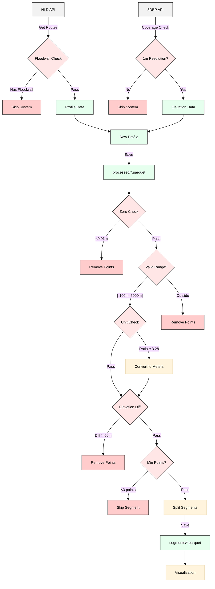

# Army Levees Analysis

A Python package for analyzing elevation differences between the National Levee Database (NLD) and USGS 3DEP data.

**🚨 DOUG! USE THIS COMMAND TO COPY THE LEVEE DATA FROM JAKE'S EXTERNAL DRIVE! 🚨**

```bash
# Copy segments data from external drive to local project
mkdir -p data/segments && \
cp -rv "/Volumes/My Passport/segments/"* "data/segments/" && \
echo "✅ Levee data copied successfully to data/segments/"
```

## Overview

This package provides tools for analyzing USACE levee systems by:
1. Sampling levee data from NLD and 3DEP sources
2. Filtering and validating elevation profiles
3. Visualizing elevation profiles and differences
4. Comparing and analyzing elevation differences
5. Exploring geographic patterns and trends
6. Classifying levees based on elevation changes

## Data Pipeline



## Installation

You can install and run this project using either Poetry or UV.

### Using UV (Recommended)

```bash
# Clone the repository
git clone <repo>
cd army_levees

# Install UV if you haven't already
curl -LsSf https://astral.sh/uv/install.sh | sh

# Create virtual environment and install dependencies
uv venv
source .venv/bin/activate  # On Windows: .venv\Scripts\activate
uv pip install -e .
```

### Using Poetry (Alternative)

```bash
# Clone the repository
git clone <repo>
cd army_levees

# Install Poetry if you haven't already
curl -sSL https://install.python-poetry.org | python3 -

# Install dependencies using Poetry
poetry install

# Activate the Poetry shell
poetry shell
```

## Usage

### Sampling Levee Data
```bash
# Using UV:
python -m army_levees.core.sample_levees -n 10

# Using Poetry:
poetry run python -m army_levees.core.sample_levees -n 10

# Increase concurrent connections
# Using UV:
python -m army_levees.core.sample_levees -n 10 --max_concurrent 4

# Using Poetry:
poetry run python -m army_levees.core.sample_levees -n 10 --max_concurrent 4
```

The sampling process:
- Checks for 1m 3DEP coverage
- Downloads NLD profile data
- Retrieves corresponding 3DEP elevations
- Saves raw data to data/processed directory
- Handles unit conversions automatically
- Skips systems with significant floodwalls

### Filtering Levee Data
```bash
# Filter with default settings
# Using UV:
python -m army_levees.core.filter_levees

# Using Poetry:
poetry run python -m army_levees.core.filter_levees

# Customize filtering parameters
# Using UV:
python -m army_levees.core.filter_levees \
    --input-dir data/processed \
    --output-dir data/segments \
    --zero-threshold 0.01 \
    --min-points 3 \
    --max-elev-diff 50.0

# Using Poetry:
poetry run python -m army_levees.core.filter_levees \
    --input-dir data/processed \
    --output-dir data/segments \
    --zero-threshold 0.01 \
    --min-points 3 \
    --max-elev-diff 50.0
```

The filtering process:
- Removes invalid elevation values
- Handles feet-to-meters conversions
- Splits profiles into valid segments
- Applies quality control checks:
  - Minimum number of points
  - Maximum elevation differences
  - Valid elevation ranges
  - Coverage requirements
- Saves filtered segments to data/segments directory

### Interactive Dashboard
```bash
# Run the dashboard with default settings
# Using UV:
python -m army_levees.core.visualize dashboard

# Using Poetry:
poetry run python -m army_levees.core.visualize dashboard

# Specify custom data directory and port
# Using UV:
python -m army_levees.core.visualize dashboard --data-dir custom/data/path --port 8040

# Using Poetry:
poetry run python -m army_levees.core.visualize dashboard --data-dir custom/data/path --port 8040
```

The dashboard provides:
- Interactive map of all levee systems
- Detailed elevation profiles with filled difference areas
- Real-time elevation difference analysis
- Satellite/street map overlays
- Color-coded elevation differences

### Individual Profile Analysis
```bash
# Plot a single system
# Using UV:
python -m army_levees.core.visualize plot 5205000591

# Using Poetry:
poetry run python -m army_levees.core.visualize plot 5205000591

# Show plot instead of saving
# Using UV:
python -m army_levees.core.visualize plot 5205000591 --show

# Using Poetry:
poetry run python -m army_levees.core.visualize plot 5205000591 --show

# Print diagnostic information
# Using UV:
python -m army_levees.core.visualize diagnose 5205000591

# Using Poetry:
poetry run python -m army_levees.core.visualize diagnose 5205000591
```

### Multi-Profile Analysis
```bash
# Plot all profiles
# Using UV:
python -m army_levees.core.visualize multi

# Using Poetry:
poetry run python -m army_levees.core.visualize multi

# Plot specific profile types
# Using UV:
python -m army_levees.core.visualize multi --type significant
python -m army_levees.core.visualize multi --type non_significant

# Using Poetry:
poetry run python -m army_levees.core.visualize multi --type significant
poetry run python -m army_levees.core.visualize multi --type non_significant

# Show plots instead of saving
# Using UV:
python -m army_levees.core.visualize multi --type significant --show

# Using Poetry:
poetry run python -m army_levees.core.visualize multi --type significant --show

# Use raw data and specify directories
# Using UV:
python -m army_levees.core.visualize multi --raw-data \
    --data-dir custom/data \
    --output-dir custom/output \
    --summary-dir custom/summary

# Using Poetry:
poetry run python -m army_levees.core.visualize multi --raw-data \
    --data-dir custom/data \
    --output-dir custom/output \
    --summary-dir custom/summary
```

## CLI Arguments

### Sampling Command
- `-n, --n_samples`: Number of systems to sample (default: 10)
- `--max_concurrent`: Maximum concurrent connections (default: 1)

### Filtering Command
- `--input-dir`: Directory containing raw parquet files (default: data/processed)
- `--output-dir`: Directory to save filtered files (default: data/segments)
- `--zero-threshold`: Threshold for considering elevation as zero (default: 0.01)
- `--min-points`: Minimum points required per segment (default: 3)
- `--max-elev-diff`: Maximum allowed elevation difference (default: 50.0)

### Dashboard Command
- `--data-dir`: Directory containing levee segment data (default: data/segments)
- `--port`: Port to run the dashboard on (default: 8050)
- `--debug`: Run in debug mode
- `--raw`: Use raw data instead of processed data

### Plot Command
- `system_id`: System ID to plot
- `--data-dir`: Directory containing levee segment data
- `--save-dir`: Directory to save plots (default: plots)
- `--raw`: Use raw data instead of processed data
- `--show`: Show plot instead of saving

### Diagnose Command
- `system_id`: System ID to diagnose
- `--data-dir`: Directory containing levee segment data
- `--raw`: Use raw data instead of processed data

### Multi-Profile Command
- `--type`: Profile type to plot (all, significant, non_significant)
- `--data-dir`: Directory containing filtered segments
- `--raw-data`: Use raw data from data/processed
- `--output-dir`: Directory to save plots (default: plots/profiles)
- `--summary-dir`: Directory containing classification CSV files
- `--show`: Show plots instead of saving them

## Project Structure

```
army_levees/
├── army_levees/          # Main package
│   ├── sample_levees.py   # Data sampling
│   ├── filter_levees.py   # Data filtering
│   └── core/            # Core functionality
│       └── visualize/   # Visualization modules
│           ├── __init__.py
│           ├── __main__.py     # CLI entry point
│           ├── dash_app.py     # Interactive dashboard
│           ├── multi_profile_plot.py  # Multi-system analysis
│           └── utils.py        # Core utilities
├── data/
│   ├── processed/       # Raw sampled data
│   └── segments/        # Filtered segments
└── plots/              # Generated plots
```

## Data Format

### Raw Data (data/processed/)
Each parquet file contains:
- `system_id`: USACE system ID
- `elevation`: NLD elevation (meters)
- `dep_elevation`: 3DEP elevation (meters)
- `dep_max_elevation`: Maximum 3DEP elevation in buffer (meters)
- `distance_along_track`: Distance along levee (meters)
- `geometry`: Point geometry (EPSG:3857)

### Filtered Segments (data/segments/)
Each parquet file contains:
- `system_id`: USACE system ID
- `elevation`: NLD elevation (meters)
- `dep_elevation`: 3DEP elevation (meters)
- `difference`: NLD - 3DEP (meters)
- `distance_along_track`: Distance along levee (meters)
- `geometry`: Point geometry (EPSG:4326)

## Classification Criteria

Levees are classified based on their mean elevation differences:
- **Significant**: Mean change > 0.1m or < -0.1m
- **Non-significant**: Mean change between -0.1m and 0.1m
