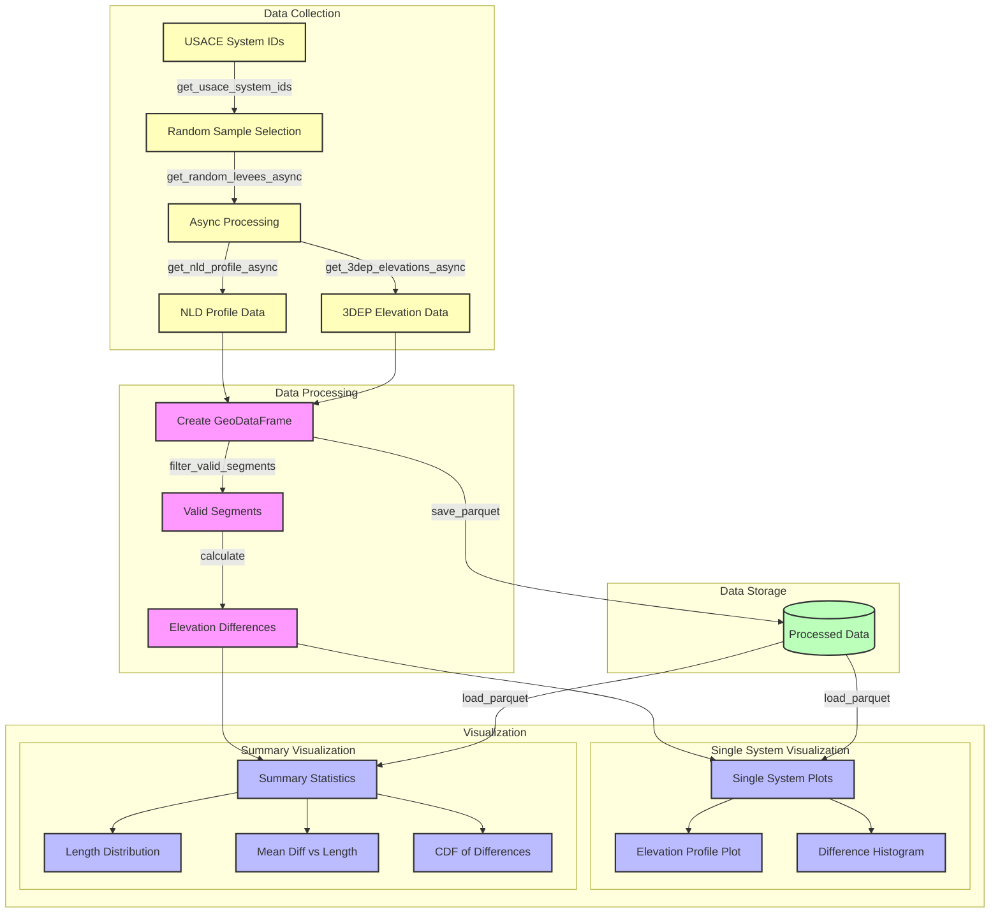

# Army Levees Analysis

A Python package for analyzing elevation differences between the National Levee Database (NLD) and USGS 3DEP data.

## Overview

This package helps collect and analyze elevation data for USACE levee systems by:
1. Getting profile data from the NLD API
2. Getting matching elevations from USGS 3DEP
3. Comparing and visualizing the differences

## System Architecture



## Quick Start

```bash
# Clone the repository
git clone <repo>
cd army_levees

# Install Poetry if you haven't already
curl -sSL https://install.python-poetry.org | python3 -

# Install dependencies using Poetry
poetry install

# Activate the Poetry shell
poetry shell
```

## Key Features

1. **Data Collection**
   - Fetches levee profiles from NLD API
   - Samples matching elevations from USGS 3DEP
   - Filters out floodwalls automatically
   - Handles coordinate system transformations

2. **Analysis**
   - Calculates elevation differences
   - Removes outliers using z-score filtering
   - Generates comprehensive statistics
   - Identifies problematic sections

3. **Visualization**
   - Individual levee plots showing:
     * Elevation profiles (NLD vs 3DEP)
     * Difference distributions
     * Coverage statistics
   - Summary plots showing:
     * Distribution of levee lengths
     * Mean elevation differences vs length
     * CDF of differences
     * Boxplots of positive/negative differences
     * Distribution of mean differences
     * Valid data coverage

## Usage Examples

### 1. Get Random Levee Samples
```python
from army_levees import get_random_levees

# Get 10 new random samples (skips already processed systems)
results = get_random_levees(n_samples=10)
```

### 2. Plot Individual Levee System
```python
from army_levees import plot_levee_system

# Create visualization for a specific system
plot_levee_system("5205000591", save_dir="plots")
```

### 3. Analyze Existing Dataset
```python
from army_levees.core.visualize_levee import plot_summary

# Generate summary plots and statistics
plot_summary(save_dir="plots")
```

## CLI

The package provides command-line tools for sampling and analyzing levee systems:

### Sample Levees
```bash
# Get 10 new random levee samples
poetry run python -m army_levees.core.sample_levees -n 10

# Include already processed systems in sampling
poetry run python -m army_levees.core.sample_levees -n 10 --include_existing

# Control concurrent connections
poetry run python -m army_levees.core.sample_levees -n 10 --max_concurrent 8
```

### Visualize Levees
```bash
# Plot a specific levee system
poetry run python -m army_levees.core.visualize_levee 5205000591

# Plot a random levee system
poetry run python -m army_levees.core.visualize_levee -r

# Create summary plots for all processed levees
poetry run python -m army_levees.core.visualize_levee -s

# Specify custom save directory
poetry run python -m army_levees.core.visualize_levee -r --save_dir custom_plots
```

### CLI Arguments

**sample_levees.py**:
- `-n, --n_samples`: Number of systems to sample (default: 10)
- `--include_existing`: Include already processed systems in sampling
- `--max_concurrent`: Maximum number of concurrent connections (default: 4)

**visualize_levee.py**:
- `system_id`: USACE system ID to plot
- `-r, --random`: Plot a random levee system
- `-s, --summary`: Create summary plots for all processed levees
- `--save_dir`: Directory to save plots (default: plots)

## Project Structure

```
army_levees/
├── army_levees/          # Main package
│   └── core/            # Core functionality
│       ├── nld_api.py   # NLD API interface
│       ├ sample_levees.py  # Sampling functions
│       └── visualize_levee.py  # Visualization
├── data/
│   └── processed/       # Processed parquet files
│       ├── levee_*.parquet  # Individual system data
│       └── dataset_summary.csv
├── docs/               # Documentation
├── plots/             # Generated plots
├── tests/             # Test suite
├── pyproject.toml     # Poetry configuration
└── README.md
```

## Data Format

Each parquet file contains:
- `system_id`: USACE system ID
- `elevation`: NLD elevation (meters, converted from feet)
- `dep_elevation`: 3DEP elevation (meters)
- `difference`: NLD - 3DEP (meters)
- `distance_along_track`: Distance along levee (meters)
- `geometry`: Point geometry (EPSG:4326)


## Contributing

To add more samples to the dataset:
1. Install the package as above
2. Run `poetry run python scripts/sample_levees.py -n 10`
3. New samples will be added to `data/processed/`

The script will:
- Skip systems that are already processed
- Show dataset statistics
- Generate visualizations
- Save a summary CSV

## Dependencies

Key packages (see pyproject.toml for full list):
- geopandas (^0.14.1)
- shapely (^2.0.2)
- pandas (^2.1.3)
- numpy (^1.26.2)
- matplotlib (^3.8.2)
- seaborn (^0.13.0)
- py3dep (^0.16.2)
- pyarrow (^15.0.0)
- requests (^2.31.0)

## Development

For development:
```bash
# Install dev dependencies
poetry install --with dev

# Run tests
poetry run pytest

# Format code
poetry run black .
```
