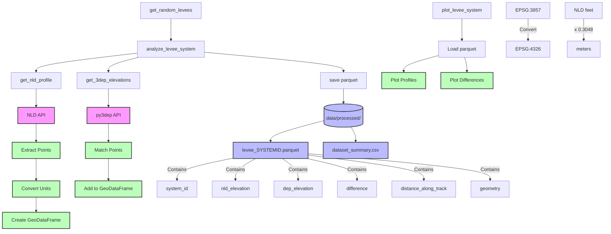

# Army Levees Analysis

A Python package for analyzing elevation differences between the National Levee Database (NLD) and USGS 3DEP data.

## Overview

This package helps collect and analyze elevation data for USACE levee systems by:
1. Getting profile data from the NLD API
2. Getting matching elevations from USGS 3DEP
3. Comparing and visualizing the differences

## System Architecture



## Installation

```bash
# Clone the repository
git clone <repo>
cd army_levees

# Install dependencies with Poetry
poetry install
```

## Usage

The package provides a simple interface to collect and analyze levee data:

```python
from army_levees import get_random_levees, plot_levee_system

# Get new samples (skips already processed systems by default)
results = get_random_levees(n_samples=10)

# Plot a specific system
plot_levee_system("5205000591", save_dir="plots")
```

For a complete example, run:
```bash
poetry run python examples/demo.py
```

## Data Structure

```
army_levees/
├── data/
│   └── processed/          # Processed parquet files
│       ├── levee_*.parquet # Individual system data
│       └── dataset_summary.csv
└── plots/                  # Generated plots
```

Each parquet file contains:
- `system_id`: USACE system ID
- `nld_elevation`: Elevation from NLD (meters)
- `dep_elevation`: Elevation from 3DEP (meters)
- `difference`: NLD - 3DEP (meters)
- `distance_along_track`: Distance along levee (meters)
- `geometry`: Point geometry (EPSG:4326)

## Documentation

See the `docs/` directory for:
- Comparative Analysis Report
- ERDC Updates
- Presentations
- Technical Guides

## Contributing

To add more samples to the dataset:
1. Install the package as above
2. Run `poetry run python examples/demo.py`
3. New samples will be added to `data/processed/`

The script will:
- Skip systems that are already processed
- Show dataset statistics
- Generate visualizations
- Save a summary CSV
